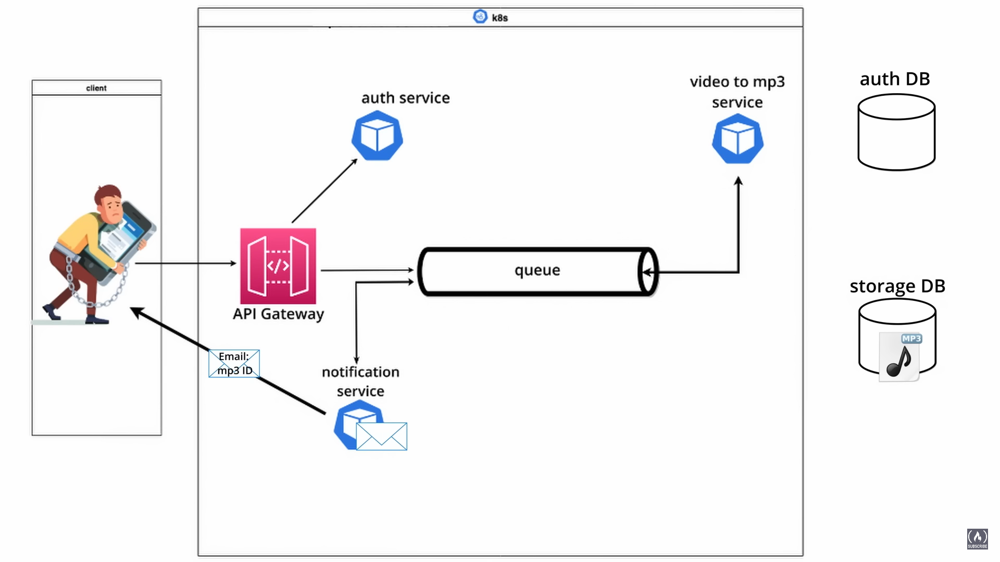
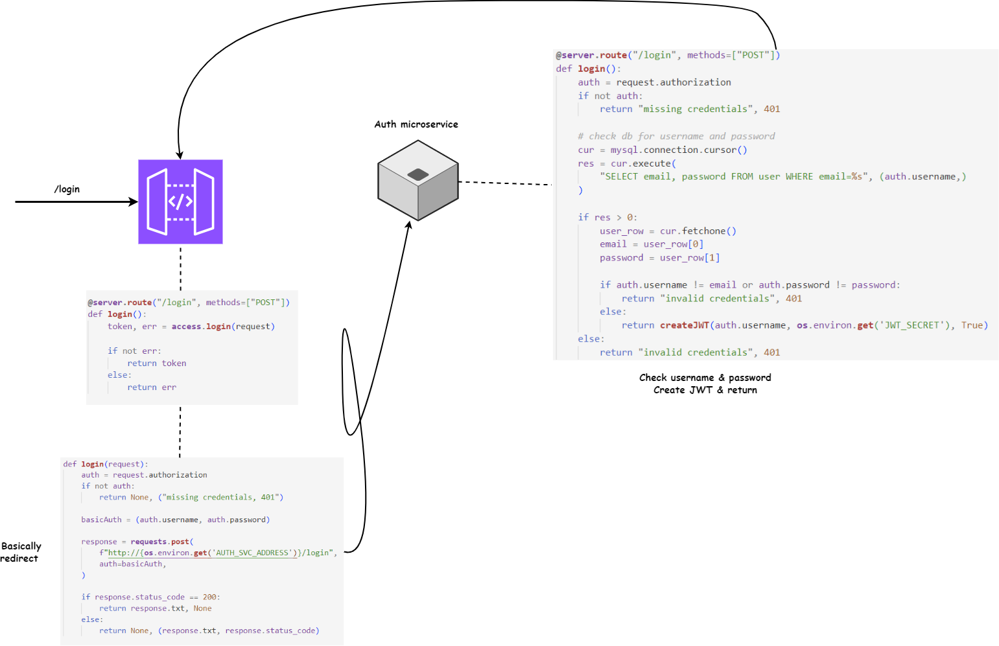

# fcc-system-design
Learn about software system design and microservices. This course is a hands-on approach to learning about microservice architectures and distributed systems using Python, Kubernetes, RabbitMQ, MongoDB, mySQL.
### Microservice Architecture and System Design with Python & Kubernetes

### Scope Diagram

### Case Diagram

