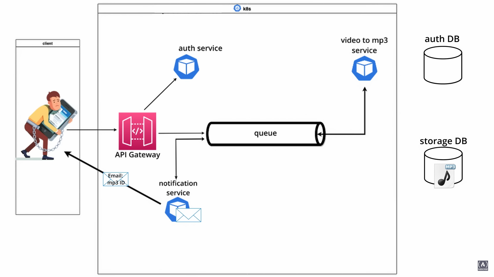
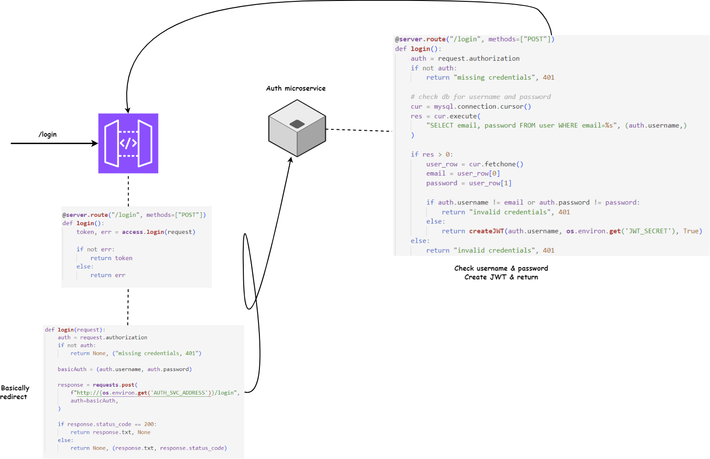

# Video-to-MP3 Converter Microservices System

A distributed microservices application that converts video files to MP3 audio format. Built with Python, Kubernetes, RabbitMQ, MongoDB, and MySQL to demonstrate modern software architecture patterns and best practices.

## Architecture Overview



The system follows an event-driven microservices architecture where services communicate asynchronously through message queues, ensuring loose coupling and horizontal scalability.

### System Flow

1. **User Authentication** - Client authenticates via the Gateway and receives a JWT token
2. **Video Upload** - Authenticated users upload videos through the API Gateway
3. **Async Processing** - Videos are queued in RabbitMQ for conversion
4. **Conversion** - Converter workers process videos and extract MP3 audio
5. **Notification** - Users receive email notifications when conversion completes
6. **Download** - Users download their MP3 files using the provided file ID



## Services

| Service | Description | Port | Replicas |
|---------|-------------|------|----------|
| **Gateway** | API entry point handling uploads, downloads, and routing | 8080 | 2 |
| **Auth** | JWT-based authentication and authorization | 5000 | 2 |
| **Converter** | Video-to-MP3 conversion worker | - | 4 |
| **Notification** | Email notification sender | - | 1 |
| **RabbitMQ** | Message broker for async communication | 5672, 15672 | 1 |
| **MailHog** | Development email server | 1025, 8025 | 1 |

## Tech Stack

- **Language:** Python 3.10
- **Web Framework:** Flask
- **Authentication:** JWT (PyJWT)
- **Databases:** MongoDB (GridFS), MySQL
- **Message Broker:** RabbitMQ
- **Video Processing:** MoviePy, FFmpeg
- **Container Runtime:** Docker
- **Orchestration:** Kubernetes
- **Ingress Controller:** NGINX

## Prerequisites

- Kubernetes cluster (Minikube recommended for local development)
- kubectl configured
- Docker
- MySQL server
- MongoDB server

## Getting Started

### 1. Database Setup

**MySQL (Auth Database):**
```sql
-- Run the init.sql script in src/auth/
CREATE DATABASE auth;
USE auth;

CREATE TABLE user (
    id INT NOT NULL AUTO_INCREMENT PRIMARY KEY,
    email VARCHAR(255) NOT NULL UNIQUE,
    password VARCHAR(255) NOT NULL
);

-- Insert a test admin user
INSERT INTO user (email, password) VALUES ('admin@example.com', 'admin123');
```

**MongoDB:**
- Ensure MongoDB is running and accessible
- The `videos` and `mp3s` databases will be created automatically

### 2. Configure Secrets

Update the secret manifests in each service's `manifests/` directory with your credentials:

- `src/auth/manifests/secret.yaml` - MySQL credentials, JWT secret
- `src/gateway/manifests/secret.yaml` - MongoDB URI, service credentials
- `src/converter/manifests/secret.yaml` - MongoDB URI, RabbitMQ credentials
- `src/notification/manifests/secret.yaml` - SMTP credentials
- `src/rabbit/manifests/secret.yaml` - RabbitMQ admin credentials

### 3. Deploy to Kubernetes

```bash
# Deploy RabbitMQ
kubectl apply -f src/rabbit/manifests/

# Deploy Auth service
kubectl apply -f src/auth/manifests/

# Deploy Gateway
kubectl apply -f src/gateway/manifests/

# Deploy Converter
kubectl apply -f src/converter/manifests/

# Deploy Notification service
kubectl apply -f src/notification/manifests/

# Deploy MailHog (development)
kubectl apply -f src/mailhog/
```

### 4. Configure Ingress

Add the following to your `/etc/hosts`:
```
127.0.0.1 mp3converter.com
127.0.0.1 rabbitmq-manager.com
```

If using Minikube, create a tunnel:
```bash
minikube tunnel
```

### 5. Create RabbitMQ Queues

Access the RabbitMQ management UI at `http://rabbitmq-manager.com` and create two queues:
- `video` - For pending video conversion jobs
- `mp3` - For conversion completion notifications

## API Reference

### Authentication

**Login**
```bash
curl -X POST http://mp3converter.com/login \
  -u admin@example.com:admin123
```

Response:
```
<jwt_token>
```

### Video Operations

**Upload Video**
```bash
curl -X POST http://mp3converter.com/upload \
  -H "Authorization: Bearer <jwt_token>" \
  -F "file=@/path/to/video.mp4"
```

**Download MP3**
```bash
curl -X GET "http://mp3converter.com/download?fid=<file_id>" \
  -H "Authorization: Bearer <jwt_token>" \
  --output audio.mp3
```

## Project Structure

```
.
├── src/
│   ├── auth/                    # Authentication service
│   │   ├── manifests/           # Kubernetes manifests
│   │   ├── server.py            # Flask application
│   │   ├── init.sql             # Database schema
│   │   └── Dockerfile
│   │
│   ├── gateway/                 # API Gateway service
│   │   ├── auth/                # Auth validation module
│   │   ├── auth_svc/            # Auth service client
│   │   ├── storage/             # MongoDB GridFS utilities
│   │   ├── manifests/           # Kubernetes manifests
│   │   ├── server.py            # Flask application
│   │   └── Dockerfile
│   │
│   ├── converter/               # Video conversion worker
│   │   ├── convert/             # Conversion logic
│   │   ├── manifests/           # Kubernetes manifests
│   │   ├── consumer.py          # RabbitMQ consumer
│   │   └── Dockerfile
│   │
│   ├── notification/            # Email notification worker
│   │   ├── send/                # Email sending module
│   │   ├── manifests/           # Kubernetes manifests
│   │   ├── consumer.py          # RabbitMQ consumer
│   │   └── Dockerfile
│   │
│   ├── rabbit/                  # RabbitMQ configuration
│   │   └── manifests/           # Kubernetes manifests
│   │
│   └── mailhog/                 # Development mail server
│       └── service.yaml
│
└── imgs/                        # Architecture diagrams
```

## Architecture Patterns

### Event-Driven Architecture
Services communicate through RabbitMQ message queues, enabling:
- Loose coupling between services
- Asynchronous processing of heavy workloads
- Independent scaling of producers and consumers

### API Gateway Pattern
The Gateway service acts as a single entry point, handling:
- Request routing
- Authentication verification
- File upload/download orchestration

### Worker Pattern
Converter and Notification services implement the worker pattern:
- Consume messages from dedicated queues
- Process tasks independently
- Acknowledge completion or retry on failure

## Scaling

The architecture supports horizontal scaling:

```bash
# Scale converter workers for higher throughput
kubectl scale deployment converter --replicas=8

# Scale gateway for more concurrent connections
kubectl scale deployment gateway --replicas=4
```

## Monitoring

- **RabbitMQ Management:** `http://rabbitmq-manager.com` - Monitor queues and message rates
- **MailHog UI:** Access on port 8025 - View sent emails in development

## License

This project is for educational purposes, demonstrating microservices architecture and distributed systems design.
